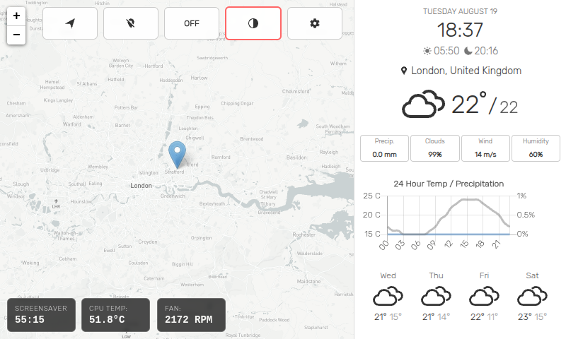

# Pi Weather Station Enhanced

This is an enhanced weather station designed to be used with a Raspberry Pi on the official 7" 800x480 touchscreen.



The weather station uses the free [Open-Meteo](https://open-meteo.com/) API for weather data (no API key required) and optionally requires API keys from [Mapbox](https://www.mapbox.com/) for map tiles. You can also use an API key from [LocationIQ](https://locationiq.com/) to perform reverse geocoding.

Weather maps are provided by the [RainViewer](https://www.rainviewer.com/) API, which generously does not require an [API key](https://www.rainviewer.com/api.html).

Sunrise and Sunset times are provided by [Sunrise-Sunset](https://sunrise-sunset.org/), which generously does not require an [API key](https://sunrise-sunset.org/api).

> The weather station will periodically make API calls to get weather updates throughout the day. Open-Meteo is free and unlimited, but be mindful of Mapbox usage limits if scrolling around the map frequently.

# Enhanced Features

- **Free Weather API**: Now uses Open-Meteo API (free, no key required) instead of paid services
- **Automatic Dark Mode**: Switches between light/dark themes based on sunrise/sunset times
- **5-Day Forecast**: Updated from 7-day due to API limitations
- **Improved Performance**: Optimized data fetching and reduced API calls
- **Enhanced UI**: Better responsive design and touch interactions

# Setup

> You will need to have [Node.js](https://nodejs.org/) installed.

To install, clone the repo and run

    $ npm install

Start the server with

    $ npm start

Now set point your browser to `http://localhost:8080` and put it in full screen mode (`F11` in Chromium).

## Access from another machine

It's possible to access the app from another machine, but beware that by doing so you'll be exposing the app to your entire network, and someone else could potentially access the app and retreive your API keys from the settings page. By default the app is only accessible to `localhost`, but if you would like to open it up to your network (at your own risk!), open `/server/index.js` and remove `"localhost"` from the line that contains:

```js
app.listen(PORT, "localhost", async () => {
```

so that it becomes:

```js
app.listen(PORT, async () => {
```

The server will now serve the app across your network.

# Settings

- Your API keys are saved locally (in plain text) to `settings.json`.
- The server will attempt to get your default location, but if it cannot or you wish to choose a different default location, enter the latitude and longitude under `Custom Latitude` and `Custom Longitude` in settings, which can be accessed by tapping the gear button in the lower right hand corner.
- To hide the mouse cursor when using a touch screen, set `Hide Mouse` to `On`.

# Do you want to Host this Application in Docker?

Pi Weather Station is available as a Docker Image for AMD64 and ARM infrastructures. see the *ReadME* here for more: https://github.com/SeanRiggs/pi-weather-station/blob/master/Docker%20Image/Docker-ReadMe.md

# License

The MIT License (MIT)

Copyright (c) 2024 xdmos

Permission is hereby granted, free of charge, to any person obtaining a copy of this software and associated documentation files (the "Software"), to deal in the Software without restriction, including without limitation the rights to use, copy, modify, merge, publish, distribute, sublicense, and/or sell copies of the Software, and to permit persons to whom the Software is furnished to do so, subject to the following conditions:

The above copyright notice and this permission notice shall be included in all copies or substantial portions of the Software.

THE SOFTWARE IS PROVIDED "AS IS", WITHOUT WARRANTY OF ANY KIND, EXPRESS OR IMPLIED, INCLUDING BUT NOT LIMITED TO THE WARRANTIES OF MERCHANTABILITY, FITNESS FOR A PARTICULAR PURPOSE AND NONINFRINGEMENT. IN NO EVENT SHALL THE AUTHORS OR COPYRIGHT HOLDERS BE LIABLE FOR ANY CLAIM, DAMAGES OR OTHER LIABILITY, WHETHER IN AN ACTION OF CONTRACT, TORT OR OTHERWISE, ARISING FROM, OUT OF OR IN CONNECTION WITH THE SOFTWARE OR THE USE OR OTHER DEALINGS IN THE SOFTWARE.
