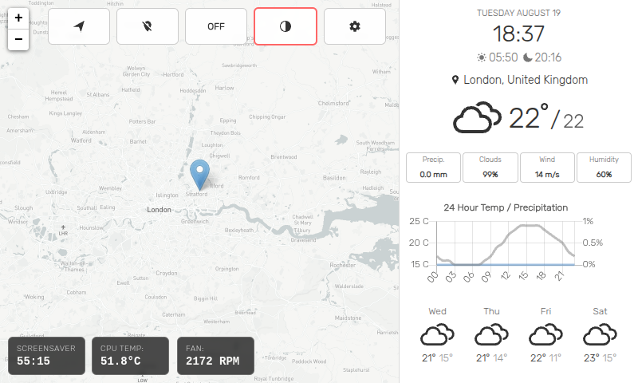

# Pi Weather Station Enhanced

This is an enhanced weather station designed to be used with a Raspberry Pi on 5" 800x600 touchscreens.

The weather station uses the free [Open-Meteo](https://open-meteo.com/) API for weather data (no API key required) and optionally requires API keys from [Mapbox](https://www.mapbox.com/) for map tiles. You can also use an API key from [LocationIQ](https://locationiq.com/) to perform reverse geocoding.

Weather maps are provided by the [RainViewer](https://www.rainviewer.com/) API, which generously does not require an [API key](https://www.rainviewer.com/api.html). The map displays current precipitation radar data only (animation functionality removed for simplicity).

Sunrise and Sunset times are provided by [Sunrise-Sunset](https://sunrise-sunset.org/), which generously does not require an [API key](https://sunrise-sunset.org/api).

> The weather station will periodically make API calls to get weather updates throughout the day. Open-Meteo is free and unlimited, but be mindful of Mapbox usage limits if scrolling around the map frequently.

# Enhanced Features

- **Free Weather API**: Open-Meteo API (no key required) with RainViewer radar overlay
- **Touch-Optimized Interface**: Simplified design for 5" 800x600 touchscreens  
- **System Monitoring**: CPU temperature monitoring with color-coded alerts
- **Automatic Dark Mode**: Switches based on sunrise/sunset times
- **Interactive Screensaver**: One-click toggle with burn-in protection
- **4-Day Forecast**: Future-focused weather planning

# Setup

> You will need to have [Node.js](https://nodejs.org/) installed.

To install, clone the repo and run

    $ npm install

Start the server with

    $ npm start

Now set point your browser to `http://localhost:8080` and put it in full screen mode (`F11` in Chromium).

For optimal experience on Raspberry Pi touchscreens, launch Chromium in kiosk mode:

    $ DISPLAY=:0 chromium-browser --start-fullscreen --kiosk http://localhost:8080

## Production Setup (Raspberry Pi)

For automatic startup on boot, use the included systemd services:

    $ sudo cp pi-weather-station.service /etc/systemd/system/
    $ sudo cp pi-weather-kiosk.service /etc/systemd/system/
    $ sudo systemctl daemon-reload
    $ sudo systemctl enable pi-weather-station.service
    $ sudo systemctl enable pi-weather-kiosk.service

# Settings

- **API Keys**: Mapbox token required for maps, LocationIQ token optional for location names
- **Custom Location**: Set latitude/longitude if auto-detection fails
- **Simplified Interface**: Fixed units (°C, m/s, mm, 24h) and screensaver settings (1hr/2min)
- Access via gear button (⚙️) in top-right corner

# Control Buttons

Located in the top-left corner for easy touchscreen access:
- **🧭 Location Reset**: Return map to current/default position
- **📍 Marker Toggle**: Show/hide location marker on map
- **ON/OFF Mouse**: Toggle mouse cursor visibility (replaces radar animation)
- **🌓 Theme**: Cycle through Light → Dark → Auto modes (auto indicated by red border)
- **⚙️ Settings**: Open configuration panel

# Recent Updates (August 2025)

- **Simplified Interface**: Removed unit toggles and complex screensaver options
- **Interactive Controls**: Clickable screensaver toggle showing countdown or "OFF"  
- **CPU Temperature Alerts**: Color-coded monitoring (white/yellow/red)
- **Touch Optimizations**: Larger buttons, better spacing, enhanced readability
- **Fixed Parameters**: Standardized units and screensaver timing for consistency
- **Radar Simplification**: Removed animation controls - map shows current weather radar only
- **Mouse Control**: Moved from settings to dedicated ON/OFF button in control panel

# License

The MIT License (MIT)

Copyright (c) 2024 xdmos

Permission is hereby granted, free of charge, to any person obtaining a copy of this software and associated documentation files (the "Software"), to deal in the Software without restriction, including without limitation the rights to use, copy, modify, merge, publish, distribute, sublicense, and/or sell copies of the Software, and to permit persons to whom the Software is furnished to do so, subject to the following conditions:

The above copyright notice and this permission notice shall be included in all copies or substantial portions of the Software.

THE SOFTWARE IS PROVIDED "AS IS", WITHOUT WARRANTY OF ANY KIND, EXPRESS OR IMPLIED, INCLUDING BUT NOT LIMITED TO THE WARRANTIES OF MERCHANTABILITY, FITNESS FOR A PARTICULAR PURPOSE AND NONINFRINGEMENT. IN NO EVENT SHALL THE AUTHORS OR COPYRIGHT HOLDERS BE LIABLE FOR ANY CLAIM, DAMAGES OR OTHER LIABILITY, WHETHER IN AN ACTION OF CONTRACT, TORT OR OTHERWISE, ARISING FROM, OUT OF OR IN CONNECTION WITH THE SOFTWARE OR THE USE OR OTHER DEALINGS IN THE SOFTWARE.
